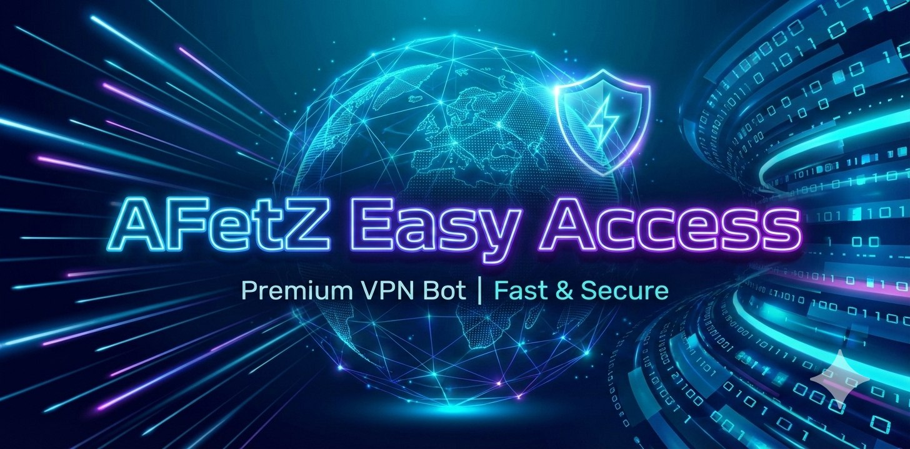

# AFZVPN Bot

<p align="center">
  
</p>

<p align="center">
  <strong>Production Telegram bot for selling, issuing, renewing, and operating AFZVPN subscriptions through 3X-UI.</strong>
</p>

<p align="center">
  <a href="https://github.com/AFETZ/AVS_AFETZ_VPN_SERVICE/releases"></a>
  <a href="https://github.com/AFETZ/AVS_AFETZ_VPN_SERVICE/actions/workflows/ci.yml"></a>
  
  
  
  <a href="LICENSE"></a>
</p>

## Что это

**AFZVPN Bot** - продовая сборка Telegram-бота для VPN-сервиса. Он связывает витрину тарифов, оплаты, 3X-UI, Happ-подключение, подписку обхода БС, админку, уведомления, бэкапы и операционные сценарии в один управляемый сервис.

Проект вырос из open-source базы `3xui-shop`, но текущий репозиторий поддерживается как кастомная production-версия AFZVPN: с собственным онбордингом, web cabinet, защитой runtime, multi-server логикой, релизным процессом и версионируемой wiki.

## Возможности

| Зона | Что уже есть |
| --- | --- |
| Продажи | тарифы, сроки, валюты, пробный период, промокоды, апгрейд на тариф с обходом БС |
| Оплаты | Telegram Stars, YooKassa, YooMoney, Cryptomus, Heleket |
| VPN | создание и продление клиентов в 3X-UI, multi-server profile, проверка активной подписки |
| Подключение | Happ для iOS, Android и Windows, deep-link `/connection`, основной профиль `/sub/{vpn_id}` |
| РФ-сценарий | отдельная настройка Happ: РФ-сервисы напрямую, остальное через VPN |
| Обход БС | рекомендуемая подписка `/wl-filtered/{vpn_id}` и запасная `/wl/{vpn_id}` |
| Админка | пользователи, серверы, статистика, промокоды, уведомления, health, бэкапы, техрежим, рестарт |
| Операции | Docker Compose, Redis FSM, SQLite, Alembic, CI, Dependabot, release archive |

## Пользовательский Флоу

1. Пользователь открывает Telegram-бота.
2. Выбирает тариф, срок и способ оплаты.
3. После оплаты бот создает или продлевает клиента в 3X-UI.
4. Пользователь открывает **Профиль -> Подключиться -> Выбор платформы**.
5. Бот показывает одинаково понятный путь для iOS, Android и Windows:
   - **Подключить основную подписку**;
   - **РФ-сервисы напрямую, остальное через VPN**;
   - **Подписка обхода БС - рекомендуется**;
   - **Подписка обхода БС - запасной вариант**;
   - **Скачать Happ**.

Основная подписка и подписка обхода БС - разные подключения. БС означает "белые списки"; это устоявшийся термин в тарифах и поддержке.

## Архитектура

```text
Telegram user
  -> aiogram bot
  -> Subscription / Payment / Admin services
  -> SQLite + Redis
  -> 3X-UI panels
  -> aiohttp public endpoints
  -> Happ / payment gateways / web cabinet
```

| Компонент | Ответственность |
| --- | --- |
| `app/__main__.py` | старт bot + web app, polling/webhook, scheduler, Redis, gateway setup |
| `app/bot/routers` | Telegram UI, callback flow, админские экраны |
| `app/bot/services` | бизнес-логика подписок, 3X-UI, серверов, jobs, runtime metrics |
| `app/web` | публичные subscription endpoints, connection redirect, cabinet |
| `app/db` | SQLAlchemy models и Alembic migrations |
| `plans.json` | commercial plan catalog |

## Public Endpoints

| Route | Назначение |
| --- | --- |
| `/healthz` | health check |
| `/webhook` | Telegram webhook endpoint |
| `/connection` | redirect для Happ deep-links |
| `/sub/{vpn_id}` | основная подписка |
| `/wl-filtered/{vpn_id}` | рекомендуемая подписка обхода БС |
| `/wl/{vpn_id}` | запасная подписка обхода БС |
| `/cabinet/{vpn_id}` | web cabinet пользователя |
| `/yookassa`, `/yoomoney`, `/cryptomus`, `/heleket` | payment callbacks |

## Быстрый Старт

```bash
git clone https://github.com/AFETZ/AVS_AFETZ_VPN_SERVICE.git
cd AVS_AFETZ_VPN_SERVICE
cp .env.example .env
```

Заполнить `.env`, проверить `plans.json`, затем запустить:

```bash
docker compose up -d --build
```

Только production bot service:

```bash
docker compose up -d --build bot
docker logs --tail=120 3xui-shop-bot
```

## Ключевые Настройки

| Variable | Для чего |
| --- | --- |
| `BOT_TOKEN` | токен Telegram-бота |
| `BOT_DOMAIN` | публичный HTTPS base URL |
| `BOT_USE_WEBHOOK` | `True` для webhook, `False` для polling |
| `BOT_PROXY_URL` | SOCKS5 proxy для Telegram API, если нужен |
| `XUI_USERNAME`, `XUI_PASSWORD` | доступ к 3X-UI |
| `XUI_SUBSCRIPTION_*` | схема, порт и path подписки 3X-UI |
| `SHOP_PAYMENT_*_ENABLED` | включение платежных шлюзов |
| `LOG_MAX_BYTES`, `LOG_BACKUP_COUNT` | ротация `app/logs/app.log` |

Полный список - в [.env.example](.env.example).

## Тарифы

Тарифы описываются в [plans.json](plans.json). Важные поля:

- `code` - стабильный код тарифа;
- `title` - название для пользователя;
- `devices` - лимит устройств;
- `prices` - цены по валютам и срокам;
- `includes_additional_profile` - доступ к подписке обхода БС;
- `upgrade_from` - тариф, с которого разрешен апгрейд.

## Качество

Локальный прогон:

```bash
poetry install --no-interaction --no-root
poetry run pytest
```

Через Docker:

```bash
docker run --rm -v "$PWD:/repo" -w /repo 3xui-shop-bot \
  sh -lc 'poetry install --no-interaction --no-root && poetry run python -m pytest tests'
```

Последний полный baseline-прогон: `112 passed`.

## Документация

Wiki-source хранится в [docs/wiki](docs/wiki), поэтому документация версионируется вместе с кодом.

- GitHub Wiki: https://github.com/AFETZ/AVS_AFETZ_VPN_SERVICE/wiki
- Release notes: [CHANGELOG.md](CHANGELOG.md)
- Версионирование: [docs/versioning_ru.md](docs/versioning_ru.md)
- Release process: [docs/release_process_ru.md](docs/release_process_ru.md)

Синхронизация wiki:

```bash
scripts/sync_github_wiki.sh https://github.com/AFETZ/AVS_AFETZ_VPN_SERVICE.wiki.git
```

## Безопасность

Не коммитить:

- `.env`, `.env.staging`;
- базы SQLite и дампы;
- Redis data;
- payment keys;
- 3X-UI credentials;
- логи и backup bundles.

Перед push:

```bash
git status --short --ignored
git diff --cached --name-only
git diff --cached --check
```

## Contributors

GitHub показывает contributors по авторам коммитов в истории Git. Это не список людей с текущим доступом к репозиторию.

В этом репозитории видны 7 GitHub-профилей, потому что история включает исходный `3xui-shop`, pull requests из upstream-этапа и AFZVPN production-коммиты. Права на push проверяются отдельно в GitHub settings, а не по блоку Contributors.

## Credits

AFZVPN Bot построен на базе open-source экосистемы `3xui-shop` и адаптирован под production-операции AFZVPN.

Внешние источники правил для подписки обхода БС:

- https://github.com/zieng2/wl
- https://github.com/igareck/vpn-configs-for-russia
